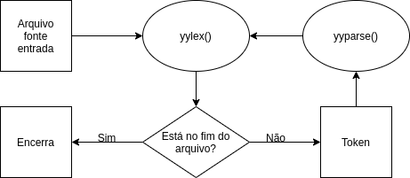

# c--
Um reduzido analisador léxico e sintático de um subconjunto da linguagem procedural C.

## Integrantes:
    - Victor Emanuel Almeida;
    - Marco Aurélio Guerra Pedroso.

## A linguagem c--:

### Descrição da linguagem
O objetivo da linguagem C-- é implementar um subconjunto da linguagem procedural C, para isso recriando algumas das expressões regulares dos tokens utilizados por Dennis Ritchie. Tudo isso com o objetivo de aprimorar os nossos conhecimentos a respeito da criação de compiladores.

### Expressões regulares dos tokens reconhecidos
- comando para o preprocessador: "#"(.*)
- palavra reservada if: "if"
- palavra reservada else: "else"
- palavra reservada for: "for"
- palavra reservada while: "while"
- palavra reservada return: "return"
- palavra reservada struct: "struct"
- palavra reservada const: "const"
- tipo de dados inteiro: "u"?"int"(("8"|"16"|"32"|"64")"_t")?
- tipo de dados ponto flutuante: "float"|"double"
- tipo de dados caractere: "char"
- tipo de dados void: "void"
- atribuição: ("+"|"-"|"*"|"/"|"%"|"<<"|">>"|"&"|"|"|"^")?"="
- operador aritmético: "+""+"?|"-""-"?|"/"|"*"|"sizeof"|"["{INTEGER_LITERAL}"]"
- operador relacional: "&&"|"||"|"!"|("="|"!")"="|("<"|">")"="?
- fim de expressão: ;
- início de bloco: "{"
- fim de bloco: "}"
- abre parenteses: "("
- fecha parenteses: ")"
- inteiro literal: {DIGIT}+
- float literal: {INTEGER_LITERAL}"."{INTEGER_LITERAL}
- string literal: \\"[^\\\\n\\"]+
- char literal: \\'\\\\?.\\'
- identificador: ({LETTER})({ALPHA_NUM}|_)*

A descrição das expressões regulares supracitadas encontra-se no arquivo fonte "lexico.lex" das linhas 63-110

### Descrição da gramática
\<programa\> ::= λ
    | TOKEN_PREPROCESSOR_COMMAND \<programa\> 
    | definicao programa 

### Identificando erros
Uma vez definidos os tokens a serem identificados, foram definidas estratégias diferentes para reconhecer erros léxicos comuns, tais como:
- Qualquer caractere não reconhecido por nenhuma expressão regular é lido descartado e gerado o erro;
- Quando lidos os caracteres "(" ou "{" suas respectivas variáveis globais contadoras são incrementadas, e decrementadas quando encontrado ")" ou "}". Sendo assim caso no final do programa qualquer valor seja diferente de 0 houve erros.
- Quando lidos caracteres iniciais de char ou string literal, utiliza-se a estratégia de start conditions, ver seção 11 da referência "Start conditions", que possibilita tomar determinado caminho de leitura tendo em vista entradas diferentes.
- TODO Sintatico

## Funcionamento do software
Fluxograma da execução do software:


## Estrutura do projeto
```
.
├── build
│   ├── main.out
│   ├── Makefile
│   ├── setup_arch.sh
│   └── setup_ubuntu.sh
├── input_files
│   ├── teste_falha.c
│   └── teste_sucesso.c
├── presentation
│   ├── fluxo.drawio
│   ├── images
│   │   ├── alerta.png
│   │   ├── burrito.png
│   │   ├── eletricidade.png
│   │   ├── fluxo.png
│   │   ├── perigo.png
│   │   ├── pizza.png
│   │   └── rolo.png
│   ├── p1
│   │   ├── main.nav
│   │   ├── main.pdf
│   │   ├── main.snm
│   │   ├── main.tex
│   │   └── main.vrb
│   └── p2
│       ├── main.nav
│       ├── main.pdf
│       ├── main.snm
│       ├── main.tex
│       └── main.vrb
├── README.md
└── src
    ├── headers
    │   ├── log_type.h
    │   ├── token_definitions.h
    │   └── user_config.h
    ├── lexico.c
    ├── lexico.lex
    ├── log_info
    │   ├── logging.c
    │   └── logging.h
    ├── sintatico.tab.c
    ├── sintatico.tab.h
    ├── sintatico.y
    ├── tree
    │   └── tree.h
    └── utils
        ├── user_input.c
        ├── user_input.h
        ├── utils.c
        └── utils.h
```

Onde:
- input_files: Pasta contendo exemplos de arquivos que contém ou não erros léxicos;
- src: Pasta contendo todos os códigos fonte do projeto, sendo escritos diretamente em C, ou gerados automaticamente pelo flex.
- lexico.lex: Arquivo de especificações da linguagem c--, escrito em lex;
- sintatico.y: Arquivo de entrada para geração do parser escrito em bison
- sintatico.tab.h: Definições do parser
- sintatico.tab.c: Implementação do parser
- lexico.c: Arquivo gerado pelo flex;
- main.out: Arquivo resultado final da compilação;

## Compilando e executando
### Compilando

Para realizar o processo de compilação do projeto primeiro é necessário obter os pacotes flex e make dos repositórios oficiais para isso basta entrar na pasta build:

    cd build/

E executar:

	./setup_arch.sh

ou caso esteja no ubuntu ou outro derivado do debian:

	./setup_ubuntu.sh

Uma vez com make e flex instalado basta iniciar o processo de compilação rodando o comando:

	make

### Executando
Tendo gerado o executável "main.out" dentro da pasta build, basta executá-lo podendo passar um único argumento adicional sendo esse o caminho relativo para um arquivo texto o qual será tratado como o fonte a ser analisado, caso não tenha parâmetros o input deve vir da linha de comandos.

	./main.out [caminho_para_fonte]

## Referências
- https://ftp.gnu.org/old-gnu/Manuals/flex-2.5.4/html_mono/flex.html
